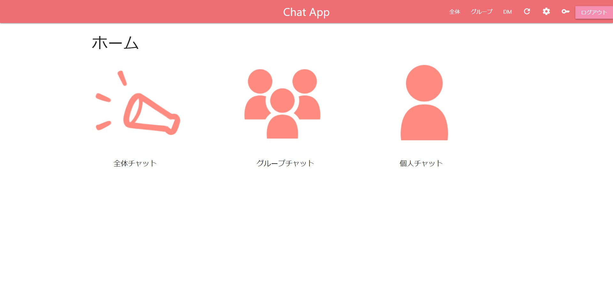

# ウェブチャットアプリ

## 機能

### 社員向け機能

- 社員間全体チャット
- グループチャット
- 個人間チャット

### 管理者向け機能

- グループの作成
- グループの割り当て
- ユーザの新規登録
- ユーザの権限変更

### その他機能

- ログイン、ログアウト
- ユーザ変更
- パスワード再設定

## デザイン写真


ホーム画面です。ここから全体チャット、グループチャット、個人チャットに遷移出来ます。

管理者用のページです。ユーザの新規登録・削除、グループの作成・割り当てなどが出来ます。

全体チャットでは社員全員とチャットすることが出来ます。

グループチャットでは同じプロジェクトメンバーとチャットが出来ます。

DM したい人を選ぶ画面です。検索機能もついておりますので、気軽に会話することが出来ます。

DM では個人間でチャットが出来るので、プライベートも守れます。

## ローカルでの使用方法

※既に一度起動している場合、$ npm run rm で sqlite ファイル(データベース)を削除する必要があります

```bash
$ npm run start
```

### ブラウザで localhost:3000 にアクセスする。

```bash
http://localhost:3000/
```

### 実行停止方法

```bash
$ npm run delete
```

### 登録済みユーザ（初期状態）
- ID:ee999999 pass:yx5Jvg (admin)
- ID:ee000000 pass:debugger(debugger)
- ID:ee111111 pass:guest (guest)
- (src/setting.js 参照)
